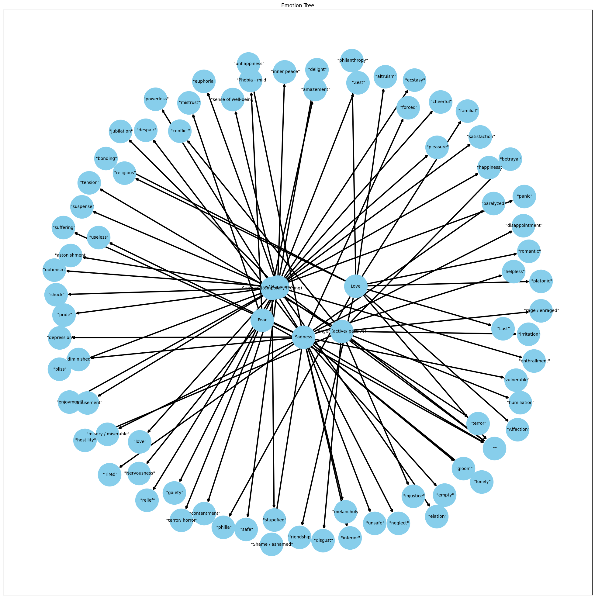
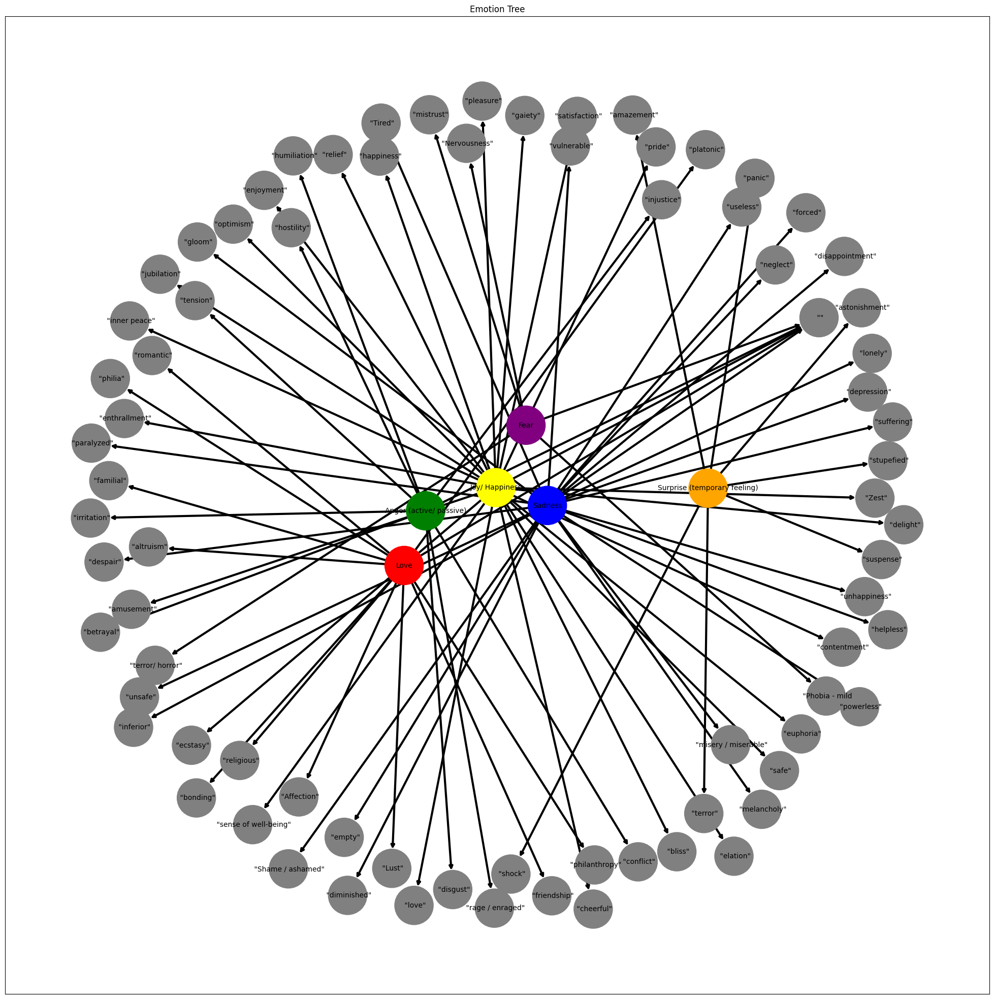

# Emotion Tree Visualization
The `emotion_tree_visualization.py` script is designed to visualize an emotion tree from a CSV file containing hierarchical data. This script downloads the CSV file, parses the data into a tree structure, and then uses NetworkX and Matplotlib to generate a visual representation of the tree. Different clusters of emotions are color-coded for easier differentiation.

### Features
- Download CSV Data: Automatically downloads the CSV file from a specified URL.
- Parse CSV Data: Converts the CSV data into a tree dictionary.
- Build Tree: Uses NetworkX to build a directed graph from the tree dictionary.
- Color-coded Clusters: Assigns different colors to different emotion clusters for visual clarity.
- Visualization: Generates and displays a visual representation of the emotion tree.

### Customization
- Cluster Colors: You can modify the `clusters` dictionary in the script to change the colors assigned to different emotion clusters.
- CSV URL: Update the `csv_url` variable to point to a different CSV file if needed.

